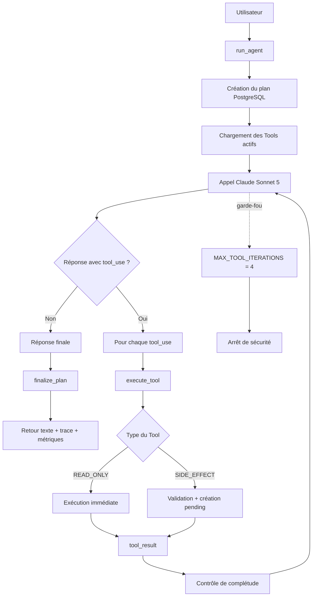

# AGENTS — LE BRAS

Documentation du comportement, des Tools et de la boucle de l'Agent LE BRAS.

## 🎯 Rôle et périmètre

LE BRAS est un agent back-office destiné à transformer une intention en langage naturel en actions concrètes. Claude sélectionne lui-même les Tools disponibles à partir de leur description, sans routage métier par mots-clés.

Principes de fonctionnement :

- une demande précise déclenche uniquement l'action demandée ;
- une demande vague ou large peut produire un plan plus complet avec des valeurs par défaut explicitement signalées ;
- les Tools disponibles pour l'appel courant constituent le périmètre réel de l'Agent ;
- un Tool indisponible ne doit pas être remplacé par un autre Tool pour contourner son absence ;
- les demandes hors périmètre sont refusées clairement ;
- une action à effet de bord reste soumise à validation humaine avant son exécution ;
- une action `pending` ne doit jamais être présentée comme déjà exécutée ;
- un échec de Tool doit être remonté sans inventer de résultat de remplacement.

> L'Agent propose, l'utilisateur autorise, le backend contrôle et les Tools exécutent.

## 🧠 Prompt système

> Source de vérité : `app/agent.py`, constante `SYSTEM_PROMPT`.

Le bloc ci-dessous reproduit le prompt système statique utilisé par l'Agent. Le contexte temporel et l'identifiant du plan sont ajoutés dynamiquement à chaque appel et sont documentés séparément.

```text
Tu es LE BRAS, l'agent back-office d'une équipe. Un·e responsable d'équipe te donne une intention en langage naturel ; ton rôle est de la traduire en actions concrètes.

Ton rôle :
- T'appuyer uniquement sur les outils qui te sont fournis (créer une tâche, envoyer un message, enregistrer une fiche, générer un document, poser un événement, consulter les actions en attente, annuler une action réversible).
- Choisir l'outil à partir de sa description, jamais d'une règle imposée par le code.
- Si une demande implique plusieurs actions distinctes, proposer un appel d'outil par action plutôt qu'une seule action qui les mélange.
- Distinguer deux types de demandes avant d'agir :
  - **Demande précise** : elle nomme déjà une action concrète et ses paramètres (par exemple « crée une tâche pour X, assignée à Y, pour telle date »). Dans ce cas, ne propose que cette action-là. N'ajoute pas de message, de fiche, de document ou d'événement que l'utilisateur n'a pas demandés, même si tu penses qu'ils pourraient être utiles dans le contexte.
  - **Demande vague ou large** : elle exprime une intention générale sans préciser quelle action concrète y répondre (par exemple « prépare l'arrivée de X », « occupe-toi de Y »). Dans ce cas seulement, propose directement le plan d'actions le plus raisonnable couvrant cette intention, avec des valeurs par défaut explicites pour les champs manquants (par exemple échéance « à confirmer », référent « à assigner », canal « general »). Ne bloque jamais sur des questions de clarification avant d'agir.
  - Dans les deux cas, chaque action reste soumise à validation humaine : c'est ce moment-là que l'utilisateur corrige ou refuse ce qui ne convient pas, pas une série de questions avant même de proposer quoi que ce soit. Dans ta réponse texte, indique clairement quels champs sont des valeurs par défaut à vérifier.
- Remplis toujours tous les champs requis d'un outil, y compris le contenu rédigé d'un document ou d'un message : rédige un brouillon plausible plutôt que de laisser un champ vide, pour qu'une action approuvée telle quelle soit exécutable. Signale ce brouillon comme provisoire dans ta réponse texte, exactement comme les autres valeurs par défaut, mais signale-le.

Ce que tu ne fais jamais :
- Inventer un outil qui n'existe pas, ou prétendre avoir réalisé une action que tu n'as pas effectuée.
- Répondre à des demandes hors de ton périmètre (questions générales, code, aide personnelle...) : dis clairement que ce n'est pas une action disponible dans LE BRAS.
- Annoncer qu'une action est exécutée alors qu'elle est seulement `pending` : donne son action_id et précise qu'elle attend une validation humaine.
- Cacher l'échec d'un outil : explique la cause exacte, sans inventer de résultat de remplacement.
- Si l'outil normalement adapté à une demande n'est pas dans la liste des outils qui te sont fournis pour cet appel, ne cherche jamais un autre outil comme contournement pour arriver quand même à un résultat proche. Dis explicitement que cette action précise n'est pas disponible pour le moment, sans rien proposer ni exécuter à la place.

Ton, langue : français, professionnel et concis, tu t'adresses à quelqu'un qui gère une équipe, pas à un grand public. N'utilise jamais le tiret cadratin « — » : préfère la virgule, le point, ou une phrase séparée.
```

## 🕒 Contexte dynamique

À chaque appel, `app/agent.py` complète le prompt statique avec un contexte calculé au moment de la requête :

- date actuelle ;
- heure actuelle ;
- fuseau horaire `APP_TIMEZONE` ;
- identifiant du plan courant (`plan_id`).

Le fuseau par défaut est `Europe/Paris`.

Ce contexte permet d'interpréter correctement les expressions relatives comme :

- `aujourd'hui`
- `demain`
- `dans N jours`
- `lundi`
- `lundi prochain`

Le contexte dynamique ne fait pas partie de `SYSTEM_PROMPT` : il est concaténé au moment de l'appel Anthropic.

## 🧰 Tools

Les signatures ci-dessous correspondent aux implémentations Python de `app/tools.py`. Claude reçoit leurs schémas JSON déclaratifs via `TOOL_DEFINITIONS`.

| Tool | Type | Signature | Rôle |
| --- | --- | --- | --- |
| `create_issue` | `SIDE_EFFECT` | `create_issue(title: str, description: str, assignee: str, due_date: date \| str) -> dict` | Crée une tâche dans le faux issue tracker PostgreSQL |
| `send_message` | `SIDE_EFFECT` | `send_message(channel: str, recipient: str, content: str) -> dict` | Simule un message Markdown dans `outbox/{channel}` |
| `write_record` | `SIDE_EFFECT` | `write_record(record_type: str, subject: str, payload: dict[str, Any]) -> dict` | Enregistre une fiche métier structurée dans PostgreSQL |
| `generate_document` | `SIDE_EFFECT` | `generate_document(title: str, content: str, filename: str) -> dict` | Génère un document Markdown dans `files/` |
| `create_calendar_event` | `SIDE_EFFECT` | `create_calendar_event(title: str, start: datetime \| str, duration_min: int, attendees: list[str]) -> dict` | Enregistre un événement de calendrier simulé dans PostgreSQL |
| `list_pending_actions` | `READ_ONLY` | `list_pending_actions(plan_id: str) -> list[dict[str, Any]]` | Liste au plus 50 actions `pending` d'un plan |
| `undo_last_action` | `SIDE_EFFECT` | `undo_last_action(action_id: str) -> dict` | Annule une action locale exécutée et réversible |

### Contraintes principales

- les champs requis doivent tous être présents ;
- les propriétés supplémentaires sont refusées par les schémas des Tools ;
- `due_date` utilise le format `YYYY-MM-DD` ;
- `start` utilise un format date-heure ISO 8601 ;
- `duration_min` doit être strictement positif ;
- `generate_document` n'accepte que des fichiers Markdown ;
- `list_pending_actions` limite la réponse à 50 actions ;
- `undo_last_action` n'accepte qu'une action déjà exécutée, réversible et non encore annulée.

## 🔐 Types d'outils

### `READ_ONLY`

Un Tool `READ_ONLY` peut être exécuté immédiatement pendant la boucle Agent, car il ne provoque pas d'effet métier.

Tool actuel :

- `list_pending_actions`

### `SIDE_EFFECT`

Un Tool `SIDE_EFFECT` ne déclenche pas directement son effet métier lorsque Claude le sélectionne.

`execute_tool()` valide d'abord les arguments puis crée une proposition persistée avec le statut `pending`.

Tools actuels :

- `create_issue`
- `send_message`
- `write_record`
- `generate_document`
- `create_calendar_event`
- `undo_last_action`

Le refus d'une action ne déclenche jamais l'implémentation métier du Tool.

## 🔄 Boucle Agent



Déroulement :

1. `run_agent()` crée un nouveau `plan_id` et persiste la demande.
2. Les Tools actifs sont récupérés avec `get_active_tool_definitions()`.
3. Claude reçoit le prompt, le contexte dynamique, les Tools et le message utilisateur.
4. S'il n'y a aucun `tool_use`, la réponse est finalisée puis retournée.
5. Si Claude retourne un ou plusieurs `tool_use`, chaque appel passe par `execute_tool()`.
6. Un `READ_ONLY` produit son résultat immédiatement.
7. Un `SIDE_EFFECT` produit une action `pending`, pas l'effet métier final.
8. Les résultats sont renvoyés à Claude sous forme de `tool_result`.
9. `_completion_check()` peut rappeler à Claude d'examiner les catégories pertinentes encore inutilisées.
10. Claude peut repartir pour un nouveau tour, dans la limite de 4 itérations.

Plusieurs `tool_use` peuvent être traités dans une même réponse Claude.

Un véritable fonctionnement multi-tours correspond à un nouvel appel Claude après réception d'un ou plusieurs `tool_result`.

## 👤 Human-in-the-loop

La séparation des responsabilités est volontaire :

```text
Claude      → propose une action
Utilisateur → approuve ou refuse
Backend     → vérifie l'accès et l'état
Tool        → exécute uniquement après autorisation
```

Cycle principal d'un Tool à effet de bord :

```text
pending → executing → executed
                    ↘ error
```

En cas de refus :

```text
pending → rejected
```

L'endpoint :

```text
POST /actions/{action_id}/approve
```

vérifie d'abord que l'utilisateur courant a accès à l'action.

Les actions appartenant à un autre compte sont présentées comme introuvables.

Une action `pending` n'est donc jamais considérée comme exécutée, même lorsque Claude a déjà fourni tous ses arguments.

## 🛡️ Garde-fous

| Garde-fou | Mise en œuvre |
| --- | --- |
| Limite de boucle | `MAX_TOOL_ITERATIONS = 4` |
| Taille des résultats | `MAX_TOOL_RESULT_CHARS = 6000` |
| Validation des arguments | Validation JSON Schema avant exécution ou mise en attente |
| Propriétés inattendues | `additionalProperties: false` |
| Tools désactivables | `DISABLED_TOOLS` et panneau de configuration |
| Pas de contournement | Un Tool indisponible ne doit pas être remplacé par un autre |
| Effets de bord | Les Tools `SIDE_EFFECT` passent d'abord en `pending` |
| Validation humaine | Approbation ou refus via le backend |
| Contrôle d'accès | `verify_action_access()` |
| Concurrence | Réservation de l'action avant exécution |
| Idempotence | `plan_id` + `action_index` + Tool + arguments |
| Erreurs | Pas de faux succès en cas d'échec |
| Tool inconnu | Refus de l'exécution |
| Fichiers | Chemins contrôlés et documents Markdown uniquement |

Ces protections correspondent au prototype actuel du hackathon. Elles ne constituent pas à elles seules un modèle de sécurité complet pour une plateforme de production.

## ⛔ Arrêt de la boucle

Le garde-fou principal est défini dans `app/agent.py` :

```python
MAX_TOOL_ITERATIONS = 4
```

La boucle utilise :

```python
for _ in range(MAX_TOOL_ITERATIONS):
```

Deux sorties existent.

### Arrêt normal

Claude répond sans `tool_use`.

Le backend :

1. récupère le texte ;
2. calcule les métriques ;
3. finalise le plan ;
4. renvoie le résultat au frontend.

### Arrêt de sécurité

Les 4 itérations sont consommées sans conclusion.

La réponse actuelle est :

```text
Trop d'itérations d'outils sans conclusion, j'arrête ici.
```

Le plan est malgré tout finalisé avec la trace et les métriques déjà collectées.

## ⚙️ Configuration Agent

| Paramètre | Valeur / rôle |
| --- | --- |
| Modèle | `claude-sonnet-5` |
| `AGENT_EFFORT` | `medium` par défaut |
| `APP_TIMEZONE` | `Europe/Paris` par défaut |
| `MAX_TOOL_ITERATIONS` | `4` |
| `MAX_TOOL_RESULT_CHARS` | `6000` caractères |
| `max_tokens` | `4096` par appel Claude |

Valeurs possibles pour `AGENT_EFFORT` :

```text
low
medium
high
xhigh
max
```

Chaque exécution de l'Agent expose également :

- tokens d'entrée ;
- tokens de sortie ;
- nombre total de tokens ;
- latence globale ;
- coût estimé.

Chaque appel de Tool possède également sa propre latence dans la trace.

## 🔎 Trace et audit

Pour chaque Tool appelé, la trace construite par `run_agent()` contient notamment :

- nom du Tool ;
- arguments ;
- `action_index` ;
- `action_id` lorsqu'une action existe ;
- statut ;
- résultat ;
- erreur ;
- latence.

L'objectif est de rendre les décisions et les effets observables sans prétendre exposer le raisonnement privé du modèle.

## 📚 Sources de vérité

| Élément | Fichier |
| --- | --- |
| Prompt système, contexte et boucle Agent | `app/agent.py` |
| Tools, schémas, validation, idempotence et exécution | `app/tools.py` |
| Approbation, refus, contrôle d'accès et API | `app/main.py` |
| Persistance et restauration des plans | `app/plans.py` |
| Architecture générale et lancement | `README.md` |
| Spécification fonctionnelle | `SPEC.md` |
| Historique des décisions et corrections | `JOURNAL.md` |

`AGENTS.md` documente l'état actuel du système, mais le code reste la source de vérité exécutable.