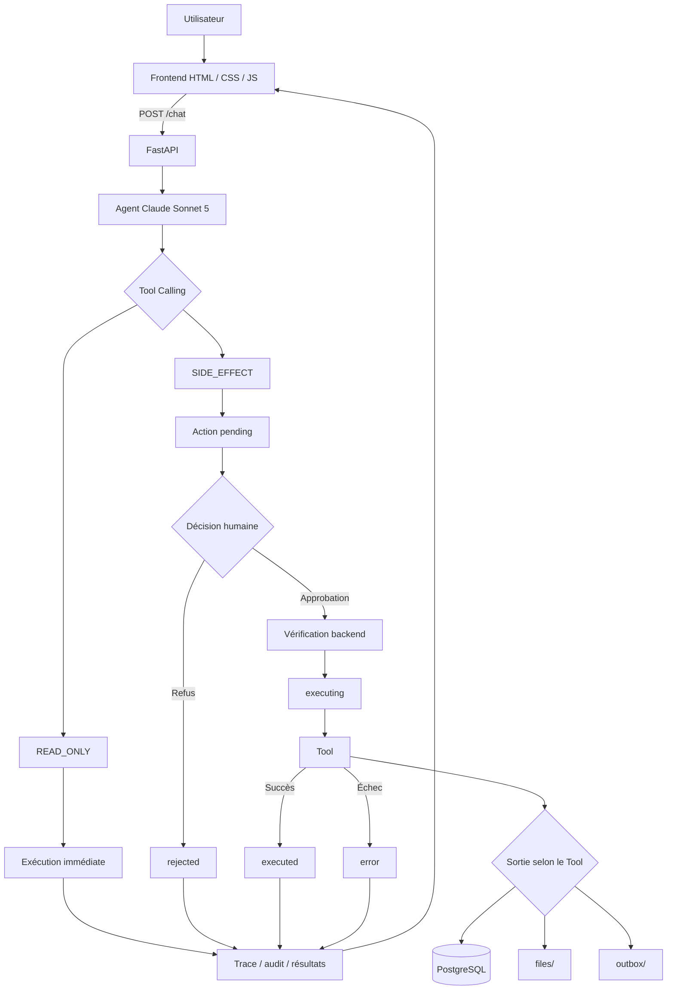

# LE BRAS

Un agent opérationnel qui transforme une intention en actions, tout en laissant le contrôle final à l’humain.

`Utilisateur → Agent → propositions d’actions → validation humaine → exécution → audit`

## 🚀 Aperçu

- L’utilisateur formule une demande en langage naturel.
- Claude Sonnet 5 sélectionne les Tools appropriés via le Tool Calling natif Anthropic.
- Les opérations en lecture seule sont exécutées immédiatement.
- Chaque action à effet de bord est créée avec le statut `pending`.
- L’utilisateur approuve ou refuse les actions une par une ; seul le backend peut lancer leur exécution.
- Résultats, refus et erreurs restent visibles dans la trace et le journal d’audit.

> L’agent propose, l’utilisateur autorise, le backend contrôle et les Tools exécutent.

## ✨ Fonctionnalités principales

| Fonctionnalité | Description |
| --- | --- |
| Agent Claude | `claude-sonnet-5`, boucle multi-tours et Tool Calling natif Anthropic |
| 7 Tools | Tâches, messages, fiches, documents, calendrier, consultation et annulation |
| Human-in-the-loop | Approbation ou refus explicite de chaque effet de bord |
| Exécution fiable | Validation des arguments, idempotence et réservation atomique des actions |
| Persistance | Plans, comptes, sessions, historiques et audit dans PostgreSQL |
| Interface | Frontend responsive, calendrier interactif et restauration du plan après F5 |
| Isolation | Contrôle d’accès aux actions, calendriers et historiques liés aux comptes |
| Observabilité | Trace technique, audit, résultats, erreurs, tokens, latence et coût estimé |
| Résilience | Erreurs Anthropic et réseau affichées sans exposer de détails sensibles |
| Configuration | Activation ou désactivation des Tools depuis l’interface, sans redémarrage |
| Évaluation | 65 tests automatisés et 9 scénarios d’évaluation manuelle/automatisée |

## 🏗️ Architecture



Le frontend affiche les propositions et transmet les décisions, sans disposer du pouvoir d’exécuter un Tool. FastAPI orchestre Claude, valide les entrées, contrôle l’accès et réserve les actions. PostgreSQL porte l’état durable ; `files/` et `outbox/` reçoivent les sorties Markdown simulées. Docker Compose exécute l’application et la base dans deux conteneurs, sans conteneur frontend séparé.

## 🔐 Human-in-the-loop

Claude ne déclenche jamais directement un effet de bord : il soumet une proposition enregistrée en `pending`. Après une approbation humaine, le backend vérifie l’accès à l’action puis effectue une transition atomique `pending → executing`. Une seule approbation concurrente peut ainsi réserver l’exécution.

- Succès : `pending → executing → executed`
- Échec du Tool : `pending → executing → error`
- Refus : `pending → rejected`, sans appel du Tool

La clé Anthropic et les autres secrets restent côté serveur dans `.env`. Une instruction injectée dans un prompt ne vaut jamais validation humaine, et un Tool en erreur n’est pas présenté comme un succès. Ces mécanismes sont les protections mises en œuvre pour cette version hackathon ; ils ne constituent pas une garantie de sécurité absolue ni un remplacement des contrôles d’une plateforme de production.

## 🧰 Tools

| Tool | Type | Rôle |
| --- | --- | --- |
| `create_issue` | `SIDE_EFFECT` | Crée une tâche dans le faux issue tracker PostgreSQL |
| `send_message` | `SIDE_EFFECT` | Simule un envoi de message dans `outbox/` |
| `write_record` | `SIDE_EFFECT` | Enregistre une fiche métier structurée dans PostgreSQL |
| `generate_document` | `SIDE_EFFECT` | Génère un document Markdown dans `files/` |
| `create_calendar_event` | `SIDE_EFFECT` | Crée un événement de calendrier dans PostgreSQL |
| `list_pending_actions` | `READ_ONLY` | Liste les actions en attente d’un plan |
| `undo_last_action` | `SIDE_EFFECT` | Annule une action locale exécutée et réversible |

[Voir la documentation complète de l’Agent](AGENTS.md)

## ⚡ Quickstart

### Prérequis

- Git
- Docker
- Docker Compose
- une clé API Anthropic valide

### 1. Cloner le dépôt

```bash
git clone https://github.com/nohamoulma-hub/Holberton-school-Hackathon-Le_Bras.git
cd Holberton-school-Hackathon-Le_Bras
```

### 2. Configurer l’environnement

```bash
cp .env.example .env
```

Renseignez ensuite votre clé dans `.env` :

```dotenv
ANTHROPIC_API_KEY=votre_cle_anthropic
```

Le fichier `.env` contient des secrets locaux : **ne le commitez jamais**. Les autres valeurs proposées dans `.env.example` permettent de démarrer l’environnement Docker sans configuration supplémentaire.

### 3. Lancer l’application

```bash
docker compose up --build
```

| Service | URL |
| --- | --- |
| Application | <http://localhost:8000> |
| Santé de l’API et de PostgreSQL | <http://localhost:8000/health> |
| Documentation FastAPI | <http://localhost:8000/docs> |

### 4. Arrêter l’application

```bash
docker compose down
```

Les volumes `postgres_data`, `files_data` et `outbox_data` conservent les données. Pour les supprimer volontairement avec les conteneurs, utilisez `docker compose down --volumes`.

## 🎬 Scénario de démonstration

Saisissez par exemple :

> Prépare l’arrivée du stagiaire Paul, équipe Data, le 25 août, buddy Sophie.

L’agent propose un plan composé d’une tâche, d’un message, d’une fiche, d’un document et d’un événement. Approuvez certaines actions, refusez-en une, puis ouvrez le journal d’audit depuis le menu : seules les actions approuvées doivent être exécutées.

## 🌐 API

| Méthode | Route | Rôle |
| --- | --- | --- |
| `GET` | `/health` | Vérifie FastAPI et la connexion PostgreSQL |
| `POST` | `/chat` | Envoie une intention à l’agent |
| `POST` | `/actions/{action_id}/approve` | Approuve et tente d’exécuter une action |
| `POST` | `/actions/{action_id}/reject` | Refuse une action en attente |
| `GET` | `/plans/{plan_id}` | Restaure un plan et ses actions |
| `GET` | `/plans/latest` | Récupère le dernier plan du compte connecté |
| `GET` | `/trace` | Consulte le journal d’audit autorisé |
| `GET` | `/tools` | Liste l’état des Tools |
| `POST` | `/tools/{tool_name}/toggle` | Active ou désactive un Tool |
| `POST` | `/auth/register`, `/auth/login`, `/auth/logout` | Gère le compte et la session |
| `GET` | `/history/conversations`, `/history/accepted-actions` | Consulte les historiques personnels |
| `GET` | `/calendar/events` | Liste les événements autorisés |

### `GET /health`

```json
{
  "status": "ok",
  "database": "ok"
}
```

### `POST /chat`

Requête minimale :

```json
{
  "message": "Prépare l'arrivée de Paul"
}
```

Réponse :

```json
{
  "response": "...",
  "trace": [],
  "plan_id": "...",
  "metrics": {
    "input_tokens": 100,
    "output_tokens": 50,
    "total_tokens": 150,
    "latency_ms": 123.4,
    "estimated_cost": 0.00105,
    "cost_status": "estimated"
  }
}
```

Le contrat détaillé et les autres routes sont également consultables dans Swagger à l’adresse <http://localhost:8000/docs>.

## 📁 Structure du projet

```text
.
├── app/                    # API, Agent, Tools, comptes et persistance
│   ├── main.py             # Routes FastAPI et frontend statique
│   ├── agent.py            # Prompt et boucle de Tool Calling
│   ├── tools.py            # Définitions, exécution, approbation et audit
│   ├── db.py               # Connexion et schéma PostgreSQL
│   ├── plans.py            # Cycle de vie et restauration des plans
│   ├── accounts.py         # Comptes et sessions
│   ├── history.py          # Historiques personnels
│   └── calendar_events.py  # Consultation et suppression des événements
├── frontend/               # Interface HTML, CSS et JavaScript
├── tests/                  # Suite automatisée PostgreSQL isolée
├── eval/                   # Cas d’évaluation et runner
├── AGENTS.md               # Périmètre et contrat de l’Agent
├── SPEC.md                 # Spécification fonctionnelle
├── JOURNAL.md              # Journal de conception
├── Makefile                # Commande d’évaluation
├── Dockerfile
└── docker-compose.yml
```

## ⚙️ Configuration

| Variable | Valeur par défaut | Usage |
| --- | --- | --- |
| `ANTHROPIC_API_KEY` | aucune | Clé API Anthropic requise |
| `AGENT_EFFORT` | `medium` | Effort Claude : `low`, `medium`, `high`, `xhigh` ou `max` |
| `APP_TIMEZONE` | `Europe/Paris` | Interprétation des dates relatives |
| `DISABLED_TOOLS` | vide | Tools désactivés au démarrage, séparés par des virgules |
| `SESSION_COOKIE_SECURE` | `false` | À passer à `true` derrière HTTPS |
| `POSTGRES_DB` | `lebras` | Base PostgreSQL locale |
| `POSTGRES_USER` | `lebras` | Utilisateur PostgreSQL local |
| `POSTGRES_PASSWORD` | `lebras_local_password` | Mot de passe PostgreSQL local à remplacer hors démo |
| `DATABASE_URL` | voir `.env.example` | URL de connexion PostgreSQL |

## 🧪 Tests et évaluation

La suite de 65 tests utilise des schémas PostgreSQL isolés et ne réalise pas d’appel Claude réel :

```bash
docker compose up -d db
docker compose run --rm app python -m unittest discover -s tests -v
```

L’évaluation rejoue 9 scénarios réels : sélection de Tool, demande vague, hors périmètre, Tool désactivé, boucle multi-tours, erreur d’exécution et injections de prompt. Elle appelle l’API Anthropic et consomme donc des tokens :

```bash
docker compose run --rm app python eval/run_eval.py
```

Avec un environnement Python et PostgreSQL configuré localement, la même évaluation est disponible via `make eval`. Les attentes et le dernier résultat documenté sont détaillés dans [`eval/cases.md`](eval/cases.md).

## 🧱 Stack

Python 3.12 · FastAPI · Uvicorn · Anthropic SDK · Claude Sonnet 5 · PostgreSQL 16 · psycopg 3 · HTML/CSS/JavaScript · Docker · Docker Compose

## ⚙️ Choix techniques

| Choix | Pourquoi |
| --- | --- |
| FastAPI | API légère et simple à exposer pendant le hackathon |
| PostgreSQL | Source de vérité persistante pour les plans, actions, comptes et audits |
| Docker Compose | Environnement reproductible avec une seule commande |
| HTML / CSS / JavaScript | Interface légère sans framework frontend |
| Tool Calling Anthropic | Claude choisit les Tools selon leur description |
| Human-in-the-loop | Aucun effet de bord sans validation humaine explicite |
| Trace et audit | Comprendre les actions observables de l’Agent |

## ↔️ Choix écartés

| Option écartée | Choix retenu | Pourquoi |
| --- | --- | --- |
| SQLite | PostgreSQL | Meilleure persistance et gestion des accès concurrents |
| Exécution directe des Tools | `pending` + validation humaine | Garder le contrôle humain |
| Routage par mots-clés | Tool Calling Claude | Éviter un routage métier codé en dur |
| Intégrations tierces réelles | Simulations locales | Prototype autonome et démontrable |
| Framework frontend | JavaScript natif | Réduire les dépendances et la complexité |

## Limites actuelles

- Les issues, messages et événements sont des intégrations locales simulées, pas des connexions à des services tiers.
- Les documents générés sont uniquement au format Markdown.
- Il n’existe pas encore de récupération de mot de passe, de vérification d’adresse e-mail, de rôles fins ou de multi-organisation.
- Le calendrier ne gère ni récurrence ni vérification de disponibilité métier.
- L’annulation cible des actions locales réversibles ; elle ne fournit pas de pile d’undo multi-niveaux.
- Sans compte, la continuité dépend des identifiants de plans conservés dans le `localStorage` du navigateur.

## Documentation

- [Spécification fonctionnelle](SPEC.md)
- [Agent et Tools](AGENTS.md)
- [Journal de conception](JOURNAL.md)
- [Cas d’évaluation](eval/cases.md)
