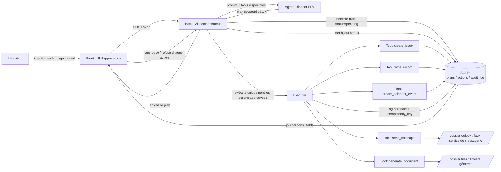

# SPEC — Sujet 03 : Le Bras

## Le problème (5 lignes)

De nombreuses situations d'équipe demandent d'accomplir manuellement une série de tâches dispersées sur plusieurs outils (arrivée d'un stagiaire, clôture d'un projet, préparation d'un événement, incident à traiter...), sans processus unifié. Résultat : oublis, doublons, tâches faites en retard ou pas faites du tout, et une exécution bâclée du cas à traiter. On propose un agent capable de transformer toute intention compatible avec les outils disponibles en langage naturel, quel que soit le cas de figure, en un plan d'actions concrètes touchant plusieurs systèmes, et de soumettre ce plan à validation humaine **action par action**, puis de n'exécuter que ce qui a été approuvé. Chaque exécution est journalisée de façon idempotente et annulable, pour qu'aucune action à effet de bord ne parte sans accord humain explicite et traçable. L'onboarding d'un stagiaire sert d'exemple de référence pour la démo, mais l'agent et ses outils restent conçus pour s'adapter à d'autres types de demandes.

## User stories (3 max)

1. **En tant qu'utilisateur**, je veux exprimer une intention en langage naturel afin que l'agent me propose un plan d'actions adapté sans rien exécuter immédiatement.

2. **En tant qu'utilisateur**, je veux approuver ou refuser chaque action du plan individuellement afin de garder le contrôle sur les actions réellement exécutées.

3. **En tant qu'utilisateur**, je veux consulter un journal d'audit afin de connaître les actions exécutées, refusées ou ayant échoué et de garder une trace de ce qui s'est passé.

## Hors scope (10 items)

- Pas de vraie intégration API tierce en v1 : on utilise une base SQLite comme "issue tracker" et un faux service de messagerie qui écrit des fichiers `.md` dans un dossier `/outbox`, assumé et documenté dans le README, remplaçable par une vraie API plus tard sans changer l'interface `Tool`.
- **Pas de gestion des conflits concurrents (deux validations simultanées sur le même plan) : on suppose un usage mono-utilisateur séquentiel, verrouillé par plan.** *(ligne candidate au bonus "non argumenté", voir plus bas)*
- Pas de catalogue métier prédéfini par type de demande : la généralisation à plusieurs cas de figure repose sur le raisonnement du LLM combiné à un petit ensemble d'outils génériques, pas sur des templates codés en dur pour chaque scénario (onboarding, incident, événement...).
- Pas de multi-utilisateurs / multi-organisation : un seul espace de travail partagé, pas d'authentification fine ni de rôles.
- Pas de fine-tuning ni d'entraînement de modèle : uniquement du prompt engineering + tool calling sur un LLM existant via API.
- Pas de récurrence dans les actions programmées : le bonus "actions programmées dans le temps" couvre des actions ponctuelles différées, pas un cron avancé.
- Pas d'undo multi-niveaux en MVP : seule la dernière action est annulable (bonus), pas de pile d'annulations en cascade.
- Pas d'interface mobile : une interface web desktop simple (ou CLI) suffit pour la démo.
- Pas de génération de fichiers autres que texte/markdown : pas de PDF, pas d'images, pas de docx.
- Pas de vérification métier du contenu (ex. vérifier que le stagiaire existe réellement en RH, que la salle est libre) : l'agent fait confiance aux informations fournies dans l'intention initiale.

## Schéma d'architecture

- **Front** : interface web simple qui affiche le plan, un bouton approuver/refuser par action, et le journal d'audit.
- **Back** : API qui orchestre agent, plan, validation et exécution, ne fait jamais confiance au front pour l'exécution réelle.
- **Agent** : appelle le LLM avec la liste des tools disponibles, reçoit un plan structuré (pas d'exécution directe). Le même agent et les mêmes tools servent quel que soit le type d'intention reçue.
- **Outils** : chacun est un adaptateur générique avec effet de bord isolé, appelé uniquement par l'Executor après validation. Aucun tool n'est spécifique à un seul scénario métier.
- **Stockage** : SQLite avec 4 tables clés : `plans`, `actions` (status: pending/approved/rejected/executed/cancelled + idempotency_key unique), `audit_log`, `records` (table générique pour les fiches créées par `write_record`, quel que soit leur type).

## Outils de l'agent

| Nom | Signature | Effet de bord |
|---|---|---|
| `create_issue` | `create_issue(title: str, description: str, assignee: str, due_date: date) -> IssueId` | **Oui** : insertion dans la table `issues` (faux issue tracker) |
| `send_message` | `send_message(channel: str, recipient: str, content: str) -> MessageId` | **Oui** : écriture d'un fichier `.md` dans `/outbox/{channel}/` (faux service de messagerie) |
| `write_record` | `write_record(record_type: str, subject: str, payload: dict) -> RecordId` | **Oui** : insertion dans la table générique `records` (`record_type` distingue onboarding, incident, événement...) |
| `generate_document` | `generate_document(title: str, content: str, filename: str) -> FilePath` | **Oui** : génération et sauvegarde d'un fichier markdown sur disque, quel que soit son contenu |
| `create_calendar_event` | `create_calendar_event(title: str, start: datetime, duration_min: int, attendees: list[str]) -> EventId` | **Oui** : insertion dans la table `calendar_events` (+ fichier `.ics` optionnel) |
| `list_pending_actions` | `list_pending_actions(plan_id: str) -> list[Action]` | Non : lecture seule |
| `undo_last_action` | `undo_last_action(action_id: str) -> bool` | **Oui** : compense/annule l'action précédente, idempotent |

Toute action a un `idempotency_key = hash(plan_id, action_index, payload)`. L'Executor vérifie cette clé avant d'exécuter : rejouer une action déjà exécutée est un no-op qui renvoie le résultat déjà loggé.

## Happy path de la démo finale (6 étapes)

Le scénario stagiaire ci-dessous sert de fil rouge pour la démo, mais le même pipeline (plan, validation, exécution, audit) s'applique sans changement de code à d'autres intentions (clôture de projet, préparation d'un événement...), en s'appuyant sur les mêmes outils génériques.

1. L'utilisateur saisit : *« Prépare l'arrivée du stagiaire Paul, équipe Data, le 25 août, buddy Sophie. »*
2. L'agent construit un plan de 5 actions (issue onboarding via `create_issue`, message à l'équipe via `send_message`, fiche stagiaire en base via `write_record`, document de bienvenue via `generate_document`, event calendrier via `create_calendar_event`) et l'affiche avec, pour chaque action, le détail de son effet de bord.
3. L'utilisateur approuve 4 actions et refuse l'event calendrier (la salle n'est pas encore réservée).
4. Le système exécute uniquement les 4 actions approuvées, dans l'ordre, chacune journalisée avec son `idempotency_key`.
5. Le journal d'audit affiche les 4 actions exécutées, horodatées, avec statut et lien vers l'effet produit (fichier, ligne en base).
6. L'utilisateur déclenche l'annulation de la dernière action exécutée (bonus) ; le journal passe son statut à "annulé" avec la compensation appliquée.

## Répartition du travail

- **Noham** : back (API orchestrateur), agent/planner (appel LLM + tool calling, capable de raisonner sur des intentions variées), gestion des doublons, journal d'audit + annulation.
- **Jonathan** : front (UI d'approbation action par action), les 5 adaptateurs Tool génériques (issue/message/record/document/calendrier), rédaction README/AGENTS.md.
- **En commun** : SPEC.md, schéma d'architecture, script de démo 5 min, tag `v1.0`.

---
**Carte bonus "Non argumenté" : ligne choisie**
> *Pas de gestion des conflits concurrents (deux validations simultanées sur le même plan) : on suppose un usage mono-utilisateur séquentiel, verrouillé par plan.*

Justification : c'est le genre de trou qu'on ne voit qu'en prod, jamais en demo, et un plan à moitié validé par deux clics simultanés casserait justement le cœur technique du sujet (human-in-the-loop fiable). L'assumer explicitement montre qu'on a pensé au risque sans sur-ingénierer une solution qu'on n'a pas le temps de livrer en 3 jours.
